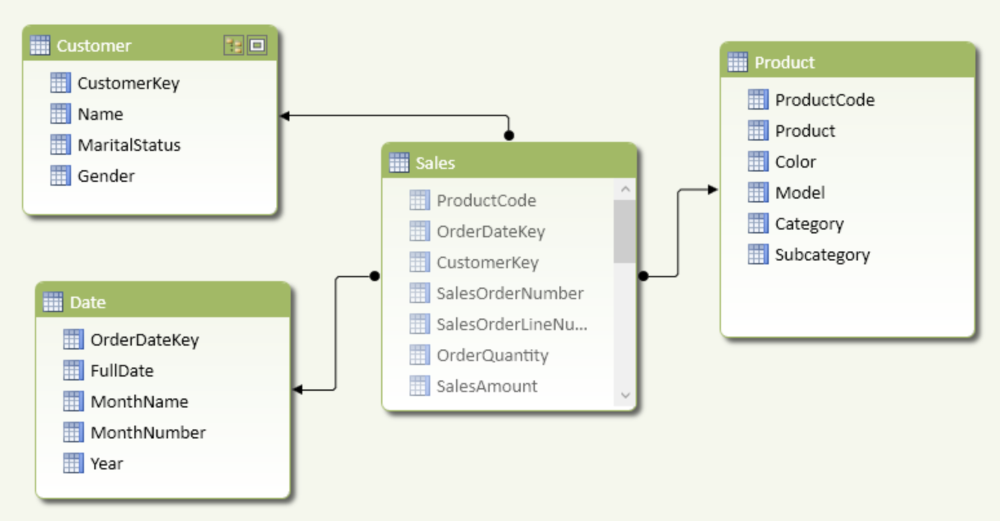

## Desafio Data Analyst - SQL

### 1. Desafio de representatividade dos ads

Recomendamos você utilizar o [SQLFiddle](http://sqlfiddle.com), PostgreSQL como engine de SQL, e o [arquivo SQL](data.sql) para construir a tabela com os seus dados e testar suas consultas.
Pense em usar CTEs e Window Functions para auxiliar

A tabela abaixo representa "ads" realizados em determinada região e pais. 

| ad_nk | data_nk | regiao_nk | pais_nk |
| --- | --- | --- | --- |
| 1 | 2018-11-06 | LATAM | AR |
| 2 | 2018-11-06 | ASIA | IN |
| 3 | 2018-11-06 | ASIA | IN |
| 4 | 2018-11-06 | LATAM | BR |
| 5 | 2018-11-07 | LATAM | AR |
| 6 | 2018-11-07 | LATAM | AR |
| 7 | 2018-11-07 | ASIA | ID |
| 8 | 2018-11-07 | ASIA | ID |
| 9 | 2018-11-07 | ASIA | IN |
| 10 | 2018-11-07 | LATAM | BR |
| 11 | 2018-11-07 | LATAM | AR |
	 
Escreva uma consulta SQL que retorne os seguintes valores:
1. Total de "ads" por dia, por pais. (A)
2. Total de "ads" na data anterior por pais. (B)
3. A diferença entra (A) e (B).
4. Total de "ads" por dia, por região.
5. O percentual de "ads" por pais/data dentro de sua região.

O resultado esperado é:

| data_nk | regiao_nk | pais_nk | Q1 | Q2 | Q3 | Q4 | Q5 |
| --- | --- | --- | --- | --- | --- | --- | --- |
| 2018-11-06 | ASIA | IN | 2 | null | null | 2 | 100.00 |
| 2018-11-06 | LATAM | AR | 1 | null | null | 2 | 50.00 |
| 2018-11-06 | LATAM | BR | 1 | null | null | 2 | 50.00 |
| 2018-11-07 | ASIA | ID | 2 | null | null | 3 | 66.67 |
| 2018-11-07 | ASIA | IN | 1 | 2 | -1 | 3 | 33.33 |
| 2018-11-07 | LATAM | AR | 3 | 1 | 2 | 4 | 75.00 |
| 2018-11-07 | LATAM | BR | 1 | 1 | 0 | 4 | 25.00 |
	 

### 2. Evolua o Modelo de Dados
Considere o modelo de vendas abaixo:

Os usuários nos reportaram um problema: Quando o cliente altera o estado civil na plataforma transacional, representada pela coluna  *MaritalStatus* na tabela *Customer* no modelo multi-dimensional , essa atualização é refletida para todas os registros anteriores de vendas (tabela *Sales*) no dashboard de vendas. Como podemos resolver isto alterando o modelo?

### 3. Problema: troca de lugares
Mary é professora de uma escola e tem um assento na mesa para armazenar os nomes dos alunos e os respectivos IDs de assento. O ID da coluna é um incremento contínuo. Mary quer trocar de lugar para os alunos adjacentes.

Você pode escrever uma consulta SQL para gerar o resultado para Mary?

|    id   | student |
|   ---   |   ---   |
|    1    | Abbot   |
|    2    | Doris   |
|    3    | Emerson |
|    4    | Green   |
|    5    | Jeames  |

Para a entrada de amostra, a saída é:

|    id   | student |
|   ---   |   ---   |
|    1    | Doris   |
|    2    | Abbot   |
|    3    | Green   |
|    4    | Emerson |
|    5    | Jeames  |

Nota:
Se o número de alunos for ímpar, não há necessidade de alterar o assento do último aluno.

### 4. Problema: Salário mais alto do departamento
A tabela Employee contém todos os funcionários. Todo funcionário tem um ID, um salário e também há uma coluna para o ID do departamento.

| Id  | Name  | Salary | DepartmentId |
| --- | ---   | ---    | ---          |
| 1   | Joe   | 70000  | 1            |
| 2   | Jim   | 90000  | 1            |
| 3   | Henry | 80000  | 2            |
| 4   | Sam   | 60000  | 2            |
| 5   | Max   | 90000  | 1            |

A tabela Departamento contém todos os departamentos da empresa.

| Id  | Name     |
| --- | ---      |
| 1   | IT       |
| 2   | Sales    |
Escreva uma consulta SQL para encontrar funcionários com o salário mais alto em cada um dos departamentos. Para as tabelas acima, sua consulta SQL deve retornar as seguintes linhas (a ordem das linhas não importa).

Saída esperada:

| Department | Employee | Salary |
| ---        | ---      | ---    |
| IT         | Max      | 90000  |
| IT         | Jim      | 90000  |
| Sales      | Henry    | 80000  |

## Como entregar
Esperamos receber um arquivo através do email com o seu nome (ex.: NomeSobrenome.zip) contendo as respostas do desafio.
